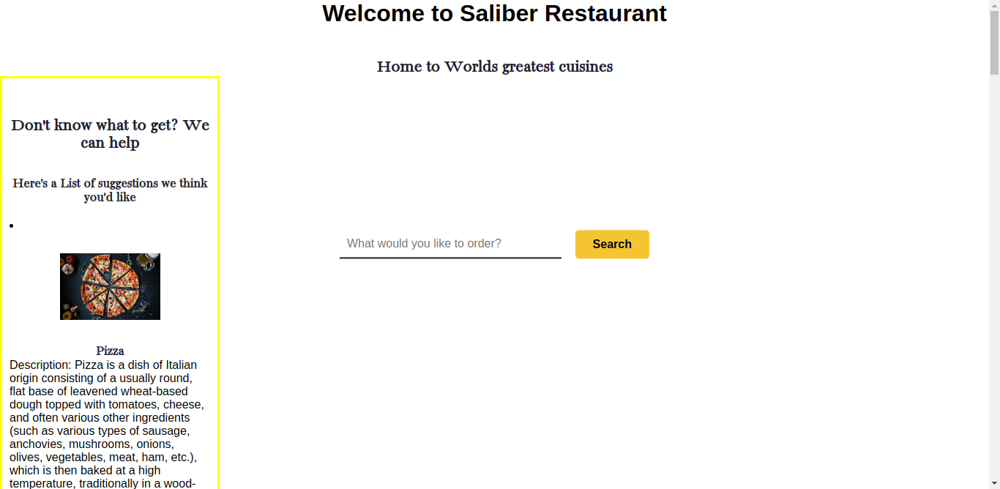
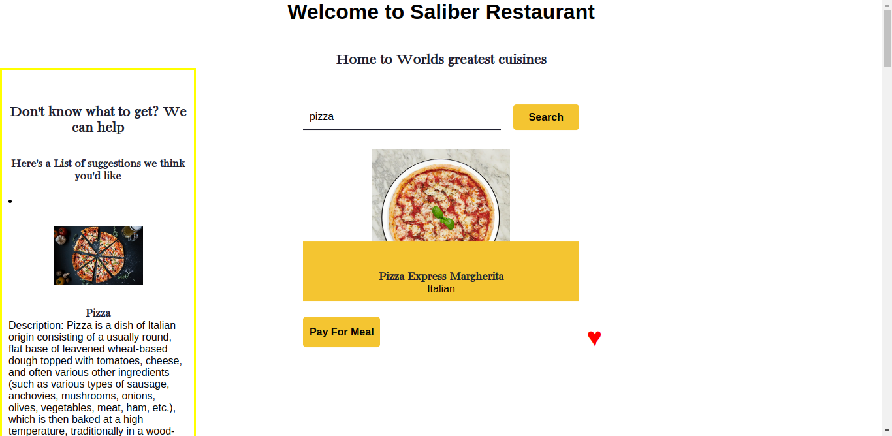
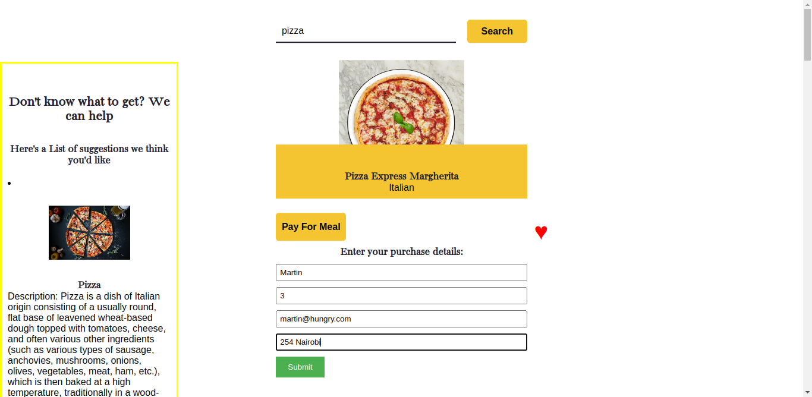
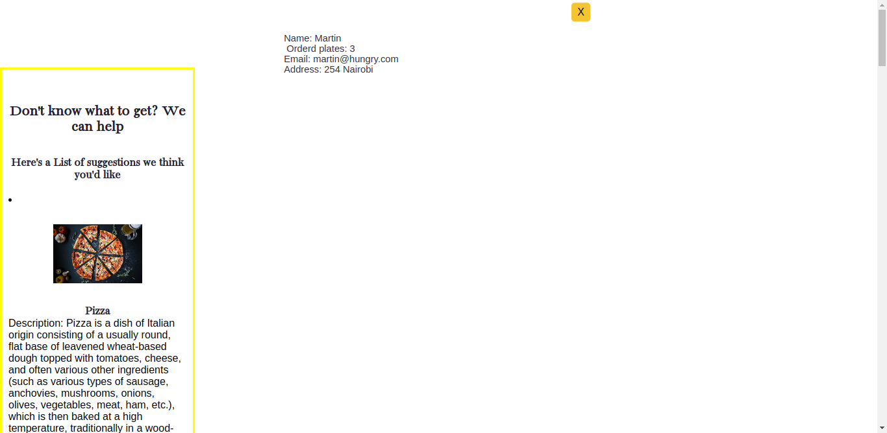
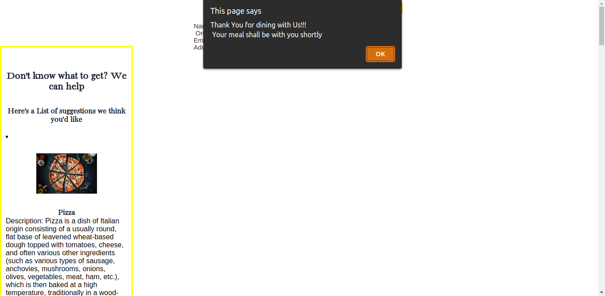
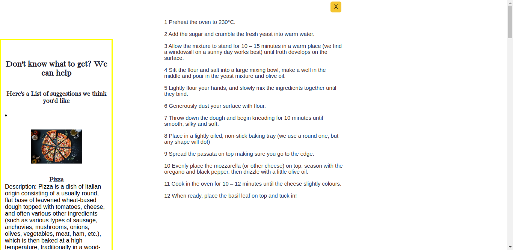

# Saliba restaurant app(Phase 1 project)

#### Created By Martin Nyaga 3-7-2023

## Git Link

[Git](https://github.com/MartinNyaga/phase1Project)

## Description

Saliba restaurant app is a webapp for a restaurant that serves a variety of cuisines from across the globe i.e china,  filipino to italian. The user searches for a meal that wants to be served, clicks on a pay button to pay for the meal and if the user liked the food, they can click on a like button and get the recipe on how to cook the meal back at home(This uses a free recipe api). If the user is unsure on what to eat, bellow will be suggestions on the type of meals they server.

## Setup Requirements

- Git
- Web-browser of your choice
- Github

## Development server

This app uses the mealdb api for the search 'https://www.themealdb.com/api/json/v1/1/search.php?s=' and also uses a db.json that is deployed to render on 'https://json-server-6ntd.onrender.com/foods' for the meal suggestions.

## Technologies Used

The following have been used on this project:

- HTML
- CSS
- JavaScript

## Screenshots 

- Homepage with food suggestions

  

- Search for food to be served

  

- Pay for meal button clicked

  

- Submit button clicked

  

- X button clicked 

  

- Like button clicked

  

## Known Bugs

No known bugs at the moment

## Support and contact details 

To make a contribution to the code used or any suggestions you can click on the contact link and email me your suggestions.

- Email: martin.nyaga@student.moringaschool.com

## License

Copyright (c) {{ 2023 }}, {{ Martin Nyaga }}

Permission to use, copy, modify, and/or distribute this software for any
purpose with or without fee is hereby granted, provided that the above
copyright notice and this permission notice appear in all copies.

THE SOFTWARE IS PROVIDED "AS IS" AND THE AUTHOR DISCLAIMS ALL WARRANTIES WITH
REGARD TO THIS SOFTWARE INCLUDING ALL IMPLIED WARRANTIES OF MERCHANTABILITY AND
FITNESS. IN NO EVENT SHALL THE AUTHOR BE LIABLE FOR ANY SPECIAL, DIRECT,
INDIRECT, OR CONSEQUENTIAL DAMAGES OR ANY DAMAGES WHATSOEVER RESULTING FROM
LOSS OF USE, DATA OR PROFITS, WHETHER IN AN ACTION OF CONTRACT, NEGLIGENCE OR
OTHER TORTIOUS ACTION, ARISING OUT OF OR IN CONNECTION WITH THE USE OR
PERFORMANCE OF THIS SOFTWARE.